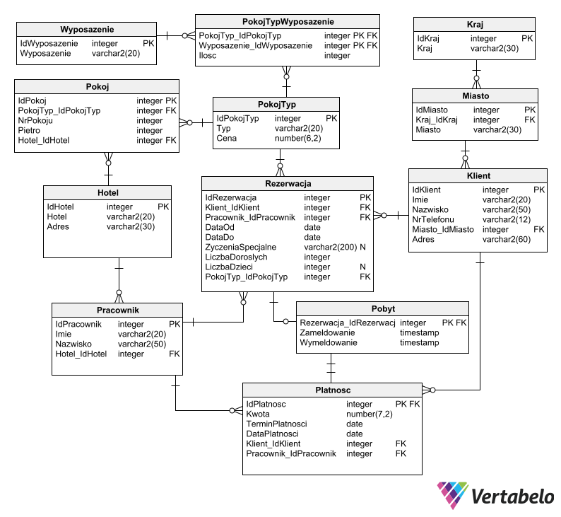

# pja-rbd-projekt

System rezerwacji hotelowych
System ma służyć do obsługi rezerwacji, pobytów i płatności w hotelu. Każda rezerwacja poza danymi pokoju i klienta musi również przechowywać informację o obsługującym je pracowniku, dacie zameldowania i wymeldowania oraz o płatności za pobyt. Nie każda rezerwacja kończy się pobytem. Ponadto system powinien przechowywać informację o pokojach ich typach oraz wyposażeniu.

Opis plików:

- [ERD.png](./ERD.png) – diagram ERD bazy danych

- [ddl-insert.sql](./ddl-insert.sql) – tworzy tabele zgodnie z diagramem
- [dml-insert.sql](./dml-insert.sql) – wypełnia tabele przykładowymi danymi

- [ddl-select.sql](./ddl-select.sql)– przykładowe zapytania do uprzednio przygotowanej bazy
- [drop.sql](./drop.sql)– usuwa wszystkie dane wraz tabelami